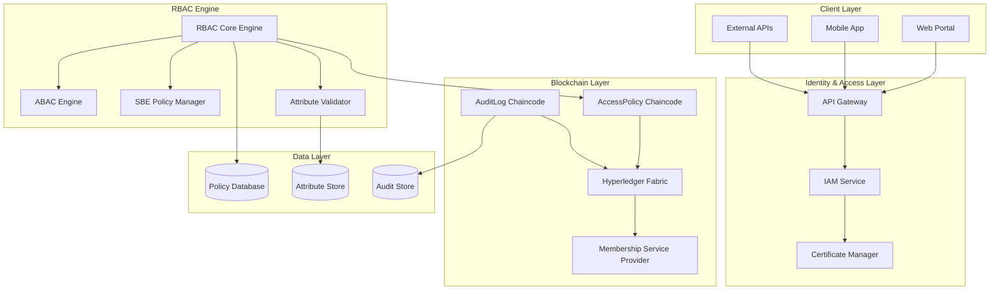
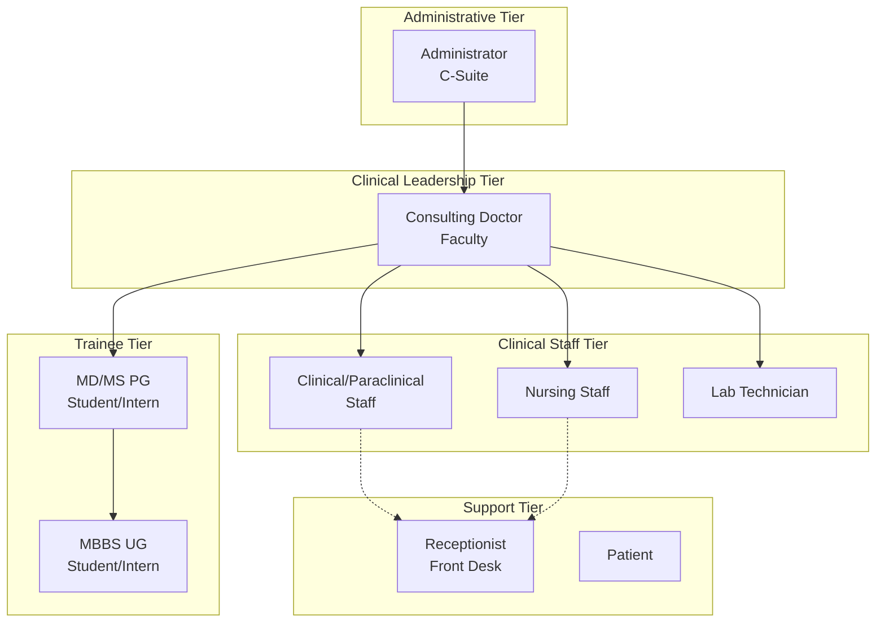

# Advanced RBAC System Design

## Overview

The Advanced RBAC System implements a sophisticated nine-role hierarchical access control system with Attribute-Based Access Control (ABAC) integration for the Medrex V2.0 platform. The system leverages Hyperledger Fabric's identity management capabilities, X.509 certificate attributes, and State-Based Endorsement (SBE) policies to enforce complex clinical governance rules while maintaining the principle of least privilege.

## Architecture

### High-Level Architecture



### Nine-Role Hierarchy Architecture



## Components and Interfaces

### 1. RBAC Core Engine

**Purpose**: Central component managing role-based access control decisions and policy enforcement.

**Key Responsibilities**:
- Role hierarchy management and inheritance
- Permission matrix enforcement
- Integration with ABAC and SBE components
- Real-time access decision making
- Policy caching and optimization

**Interfaces**:
```go
type RBACCoreEngine interface {
    ValidateAccess(ctx context.Context, req *AccessRequest) (*AccessDecision, error)
    GetUserRoles(userID string) ([]Role, error)
    GetRolePermissions(role Role) ([]Permission, error)
    UpdateRoleHierarchy(hierarchy *RoleHierarchy) error
    CachePolicy(policyID string, policy *AccessPolicy) error
}

type AccessRequest struct {
    UserID       string            `json:"user_id"`
    ResourceID   string            `json:"resource_id"`
    Action       string            `json:"action"`
    Context      map[string]string `json:"context"`
    Attributes   map[string]string `json:"attributes"`
    Timestamp    time.Time         `json:"timestamp"`
}

type AccessDecision struct {
    Allowed     bool              `json:"allowed"`
    Reason      string            `json:"reason"`
    Conditions  []string          `json:"conditions"`
    TTL         time.Duration     `json:"ttl"`
    Attributes  map[string]string `json:"attributes"`
}

type Role struct {
    ID          string   `json:"id"`
    Name        string   `json:"name"`
    NodeOU      string   `json:"node_ou"`
    Level       int      `json:"level"`
    Parent      string   `json:"parent,omitempty"`
    Children    []string `json:"children,omitempty"`
    Permissions []string `json:"permissions"`
}
```

### 2. ABAC Engine

**Purpose**: Implements Attribute-Based Access Control for context-dependent permissions.

**Key Responsibilities**:
- Certificate attribute extraction and validation
- Context-aware access decisions
- Dynamic policy evaluation
- Attribute-based filtering
- Integration with X.509 certificate attributes

**Interfaces**:
```go
type ABACEngine interface {
    EvaluatePolicy(ctx context.Context, policy *ABACPolicy, attributes map[string]string) (bool, error)
    ExtractCertificateAttributes(cert *x509.Certificate) (map[string]string, error)
    ValidateAttributeConstraints(attributes map[string]string, constraints []AttributeConstraint) error
    GetContextualAttributes(ctx context.Context, userID string) (map[string]string, error)
}

type ABACPolicy struct {
    ID          string                `json:"id"`
    Name        string                `json:"name"`
    Rules       []ABACRule            `json:"rules"`
    Conditions  []AttributeCondition  `json:"conditions"`
    Effect      PolicyEffect          `json:"effect"`
    Priority    int                   `json:"priority"`
}

type ABACRule struct {
    Attribute string      `json:"attribute"`
    Operator  string      `json:"operator"`
    Value     interface{} `json:"value"`
    Required  bool        `json:"required"`
}

type AttributeCondition struct {
    Type        string      `json:"type"`        // "time", "location", "patient_assignment"
    Constraint  string      `json:"constraint"`  // "business_hours", "ward_assignment"
    Value       interface{} `json:"value"`
}
```

### 3. State-Based Endorsement (SBE) Policy Manager

**Purpose**: Manages complex workflow governance through blockchain-enforced policies.

**Key Responsibilities**:
- SBE policy creation and management
- Workflow state tracking
- Supervisor assignment and validation
- Emergency override handling
- Policy versioning and rollback

**Interfaces**:
```go
type SBEPolicyManager interface {
    CreateSBEPolicy(ctx context.Context, policy *SBEPolicy) error
    ApplySBEPolicy(ctx context.Context, resourceID string, policy *SBEPolicy) error
    ValidateSupervisorEndorsement(ctx context.Context, resourceID, supervisorID string) error
    GetRequiredEndorsers(ctx context.Context, resourceID string) ([]string, error)
    HandleEmergencyOverride(ctx context.Context, req *EmergencyOverrideRequest) error
}

type SBEPolicy struct {
    ID                    string            `json:"id"`
    Name                  string            `json:"name"`
    ResourceType          string            `json:"resource_type"`
    TriggerConditions     []TriggerCondition `json:"trigger_conditions"`
    RequiredEndorsers     []EndorserRequirement `json:"required_endorsers"`
    TimeoutDuration       time.Duration     `json:"timeout_duration"`
    EscalationPolicy      string            `json:"escalation_policy"`
    EmergencyOverride     bool              `json:"emergency_override"`
}

type TriggerCondition struct {
    Attribute string      `json:"attribute"`
    Operator  string      `json:"operator"`
    Value     interface{} `json:"value"`
}

type EndorserRequirement struct {
    Role        string            `json:"role"`
    Attributes  map[string]string `json:"attributes"`
    MinCount    int               `json:"min_count"`
    MaxCount    int               `json:"max_count"`
}
```

### 4. Certificate Manager

**Purpose**: Manages X.509 certificates with embedded role and attribute information.

**Key Responsibilities**:
- Certificate enrollment with attributes
- Attribute embedding and extraction
- Certificate lifecycle management
- NodeOU configuration and validation
- Integration with Fabric CA

**Interfaces**:
```go
type CertificateManager interface {
    EnrollUserWithAttributes(ctx context.Context, req *EnrollmentRequest) (*x509.Certificate, error)
    ExtractUserAttributes(cert *x509.Certificate) (*UserAttributes, error)
    ValidateCertificateAttributes(cert *x509.Certificate, requiredAttrs []string) error
    RenewCertificateWithUpdatedAttributes(ctx context.Context, userID string, newAttrs map[string]string) error
    RevokeCertificate(ctx context.Context, userID string, reason string) error
}

type EnrollmentRequest struct {
    UserID      string            `json:"user_id"`
    Role        string            `json:"role"`
    Attributes  map[string]string `json:"attributes"`
    OrgMSP      string            `json:"org_msp"`
    NodeOU      string            `json:"node_ou"`
    ValidityPeriod time.Duration  `json:"validity_period"`
}

type UserAttributes struct {
    Role           string `json:"role"`
    Specialty      string `json:"specialty,omitempty"`
    IsTrainee      bool   `json:"is_trainee"`
    IsSupervisor   bool   `json:"is_supervisor"`
    WardAssignment string `json:"ward_assignment,omitempty"`
    LabOrg         string `json:"lab_org,omitempty"`
    Department     string `json:"department,omitempty"`
    Level          int    `json:"level"`
}
```

## Data Models

### Role Hierarchy Model

```go
type RoleHierarchy struct {
    Roles map[string]*RoleNode `json:"roles"`
    Root  string               `json:"root"`
}

type RoleNode struct {
    Role     Role       `json:"role"`
    Parent   *RoleNode  `json:"parent,omitempty"`
    Children []*RoleNode `json:"children,omitempty"`
    Level    int        `json:"level"`
}

// Nine-role definitions
const (
    RolePatient           = "patient"
    RoleMBBSStudent      = "mbbs_student"
    RoleMDStudent        = "md_student"
    RoleConsultingDoctor = "consulting_doctor"
    RoleNurse            = "nurse"
    RoleLabTechnician    = "lab_technician"
    RoleReceptionist     = "receptionist"
    RoleClinicalStaff    = "clinical_staff"
    RoleAdministrator    = "administrator"
)

// NodeOU mappings
var NodeOUMappings = map[string]string{
    RolePatient:           "Client-Patient",
    RoleMBBSStudent:      "Client-Trainee",
    RoleMDStudent:        "Client-Doctor-PG",
    RoleConsultingDoctor: "Client-Doctor-Faculty",
    RoleNurse:            "Client-Nurse",
    RoleLabTechnician:    "Client-LabStaff",
    RoleReceptionist:     "Client-Admin-FrontDesk",
    RoleClinicalStaff:    "Client-Specialist",
    RoleAdministrator:    "Admin-Compliance",
}
```

### Permission Matrix Model

```go
type PermissionMatrix struct {
    Roles       map[string]*RolePermissions `json:"roles"`
    Resources   map[string]*ResourceDef     `json:"resources"`
    Actions     map[string]*ActionDef       `json:"actions"`
    LastUpdated time.Time                   `json:"last_updated"`
}

type RolePermissions struct {
    RoleID      string                    `json:"role_id"`
    Permissions map[string]*Permission    `json:"permissions"`
    Constraints []PermissionConstraint    `json:"constraints"`
}

type Permission struct {
    Resource    string   `json:"resource"`
    Actions     []string `json:"actions"`
    Conditions  []string `json:"conditions,omitempty"`
    Scope       string   `json:"scope"`        // "own", "assigned", "ward", "all"
    TimeRestriction *TimeRestriction `json:"time_restriction,omitempty"`
}

type PermissionConstraint struct {
    Type        string      `json:"type"`
    Attribute   string      `json:"attribute"`
    Operator    string      `json:"operator"`
    Value       interface{} `json:"value"`
    Required    bool        `json:"required"`
}

type TimeRestriction struct {
    StartTime   string   `json:"start_time"`   // "09:00"
    EndTime     string   `json:"end_time"`     // "17:00"
    DaysOfWeek  []string `json:"days_of_week"` // ["monday", "tuesday", ...]
    Timezone    string   `json:"timezone"`
}
```

### Supervision Workflow Model

```go
type SupervisionWorkflow struct {
    ID              string                 `json:"id"`
    TraineeID       string                 `json:"trainee_id"`
    SupervisorID    string                 `json:"supervisor_id"`
    ResourceID      string                 `json:"resource_id"`
    WorkflowType    string                 `json:"workflow_type"`
    Status          SupervisionStatus      `json:"status"`
    RequiredActions []SupervisionAction    `json:"required_actions"`
    CompletedActions []CompletedAction     `json:"completed_actions"`
    CreatedAt       time.Time              `json:"created_at"`
    ExpiresAt       time.Time              `json:"expires_at"`
    Metadata        map[string]interface{} `json:"metadata"`
}

type SupervisionStatus string
const (
    StatusPending    SupervisionStatus = "pending"
    StatusInProgress SupervisionStatus = "in_progress"
    StatusCompleted  SupervisionStatus = "completed"
    StatusExpired    SupervisionStatus = "expired"
    StatusOverridden SupervisionStatus = "overridden"
)

type SupervisionAction struct {
    Type        string            `json:"type"`        // "review", "approve", "co_sign"
    Description string            `json:"description"`
    Required    bool              `json:"required"`
    Attributes  map[string]string `json:"attributes"`
}

type CompletedAction struct {
    Action      SupervisionAction `json:"action"`
    CompletedBy string            `json:"completed_by"`
    CompletedAt time.Time         `json:"completed_at"`
    Signature   string            `json:"signature"`
    Comments    string            `json:"comments,omitempty"`
}
```

## Error Handling

### RBAC-Specific Error Types

```go
type RBACErrorType string

const (
    ErrorTypeInsufficientPrivileges RBACErrorType = "insufficient_privileges"
    ErrorTypeInvalidRole           RBACErrorType = "invalid_role"
    ErrorTypeAttributeValidation   RBACErrorType = "attribute_validation"
    ErrorTypeSupervisionRequired   RBACErrorType = "supervision_required"
    ErrorTypeCertificateInvalid    RBACErrorType = "certificate_invalid"
    ErrorTypePolicyViolation       RBACErrorType = "policy_violation"
    ErrorTypeTimeRestriction       RBACErrorType = "time_restriction"
    ErrorTypeEmergencyOverride     RBACErrorType = "emergency_override"
)

type RBACError struct {
    Type        RBACErrorType `json:"type"`
    Code        string        `json:"code"`
    Message     string        `json:"message"`
    UserID      string        `json:"user_id"`
    ResourceID  string        `json:"resource_id"`
    Action      string        `json:"action"`
    RequiredRole string       `json:"required_role,omitempty"`
    MissingAttributes []string `json:"missing_attributes,omitempty"`
    Suggestions []string      `json:"suggestions,omitempty"`
}
```

### Error Handling Strategies

1. **Graceful Degradation**: Provide limited access when full permissions aren't available
2. **Clear Messaging**: Provide specific error messages without exposing sensitive information
3. **Audit Logging**: Log all access denials for security monitoring
4. **Escalation Paths**: Provide clear paths for requesting additional permissions
5. **Emergency Procedures**: Support emergency override with enhanced logging

## Testing Strategy

### Unit Testing

**RBAC Core Engine Testing**:
```go
func TestRBACCoreEngine_ValidateAccess(t *testing.T) {
    tests := []struct {
        name     string
        request  *AccessRequest
        expected *AccessDecision
        wantErr  bool
    }{
        {
            name: "consulting_doctor_full_access",
            request: &AccessRequest{
                UserID:     "doctor123",
                ResourceID: "patient456",
                Action:     "read",
                Attributes: map[string]string{
                    "role":          "consulting_doctor",
                    "is_supervisor": "true",
                    "specialty":     "cardiology",
                },
            },
            expected: &AccessDecision{
                Allowed: true,
                Reason:  "Role has sufficient privileges",
            },
            wantErr: false,
        },
        {
            name: "md_student_requires_supervision",
            request: &AccessRequest{
                UserID:     "student123",
                ResourceID: "cpoe_order456",
                Action:     "create",
                Attributes: map[string]string{
                    "role":       "md_student",
                    "is_trainee": "true",
                },
            },
            expected: &AccessDecision{
                Allowed:    false,
                Reason:     "Supervision required for trainee",
                Conditions: []string{"requires_supervisor_approval"},
            },
            wantErr: false,
        },
    }
    
    for _, tt := range tests {
        t.Run(tt.name, func(t *testing.T) {
            engine := NewRBACCoreEngine()
            decision, err := engine.ValidateAccess(context.Background(), tt.request)
            
            if (err != nil) != tt.wantErr {
                t.Errorf("ValidateAccess() error = %v, wantErr %v", err, tt.wantErr)
                return
            }
            
            assert.Equal(t, tt.expected.Allowed, decision.Allowed)
            assert.Equal(t, tt.expected.Reason, decision.Reason)
        })
    }
}
```

### Integration Testing

**Fabric Integration Testing**:
```go
func TestSBEPolicyIntegration(t *testing.T) {
    // Test State-Based Endorsement policy enforcement
    network := setupTestNetwork(t)
    defer network.Cleanup()
    
    // Create SBE policy for CPOE orders
    policy := &SBEPolicy{
        ID:           "cpoe_supervision",
        ResourceType: "cpoe_order",
        TriggerConditions: []TriggerCondition{
            {Attribute: "is_trainee", Operator: "equals", Value: "true"},
        },
        RequiredEndorsers: []EndorserRequirement{
            {Role: "consulting_doctor", Attributes: map[string]string{"is_supervisor": "true"}, MinCount: 1},
        },
    }
    
    // Test trainee submission requires supervisor endorsement
    traineeCtx := network.GetUserContext("md_student")
    _, err := network.SubmitTransaction(traineeCtx, "CreateCPOEOrder", "order123", "medication_order")
    assert.Error(t, err, "Should require supervisor endorsement")
    
    // Test supervisor endorsement allows completion
    supervisorCtx := network.GetUserContext("consulting_doctor")
    _, err = network.SubmitTransaction(supervisorCtx, "ApproveCPOEOrder", "order123")
    assert.NoError(t, err, "Supervisor should be able to approve")
}
```

### Security Testing

**Certificate Attribute Testing**:
```go
func TestCertificateAttributeExtraction(t *testing.T) {
    certManager := NewCertificateManager()
    
    // Test certificate with embedded attributes
    cert := generateTestCertificate(t, map[string]string{
        "role":          "consulting_doctor",
        "specialty":     "cardiology",
        "is_supervisor": "true",
        "department":    "internal_medicine",
    })
    
    attributes, err := certManager.ExtractUserAttributes(cert)
    assert.NoError(t, err)
    assert.Equal(t, "consulting_doctor", attributes.Role)
    assert.Equal(t, "cardiology", attributes.Specialty)
    assert.True(t, attributes.IsSupervisor)
}
```

## Deployment Architecture

### Kubernetes Deployment

```yaml
apiVersion: apps/v1
kind: Deployment
metadata:
  name: rbac-core-engine
  namespace: medrex-services
spec:
  replicas: 3
  selector:
    matchLabels:
      app: rbac-core-engine
  template:
    metadata:
      labels:
        app: rbac-core-engine
    spec:
      containers:
      - name: rbac-engine
        image: medrex/rbac-core-engine:latest
        ports:
        - containerPort: 8080
        env:
        - name: FABRIC_NETWORK_CONFIG
          value: "/etc/fabric/network-config.yaml"
        - name: RBAC_POLICY_CACHE_SIZE
          value: "10000"
        - name: ABAC_EVALUATION_TIMEOUT
          value: "5s"
        volumeMounts:
        - name: fabric-config
          mountPath: /etc/fabric
        - name: rbac-policies
          mountPath: /etc/rbac
        resources:
          requests:
            memory: "512Mi"
            cpu: "250m"
          limits:
            memory: "1Gi"
            cpu: "500m"
      volumes:
      - name: fabric-config
        configMap:
          name: fabric-network-config
      - name: rbac-policies
        configMap:
          name: rbac-policies
```

### Configuration Management

```yaml
# RBAC Configuration
rbac:
  roles:
    patient:
      node_ou: "Client-Patient"
      level: 1
      permissions:
        - resource: "own_ehr"
          actions: ["read"]
          scope: "own"
    
    consulting_doctor:
      node_ou: "Client-Doctor-Faculty"
      level: 5
      permissions:
        - resource: "patient_ehr"
          actions: ["create", "read", "update"]
          scope: "assigned"
        - resource: "cpoe_order"
          actions: ["create", "read", "update", "approve"]
          scope: "all"
      
  abac_policies:
    - id: "ward_assignment_policy"
      rules:
        - attribute: "ward_assignment"
          operator: "matches"
          value: "patient.ward"
          required: true
      
  sbe_policies:
    - id: "trainee_supervision"
      resource_type: "cpoe_order"
      trigger_conditions:
        - attribute: "is_trainee"
          operator: "equals"
          value: true
      required_endorsers:
        - role: "consulting_doctor"
          attributes:
            is_supervisor: "true"
          min_count: 1
```

This advanced RBAC system provides the sophisticated access control required for complex healthcare environments while maintaining security, compliance, and usability.