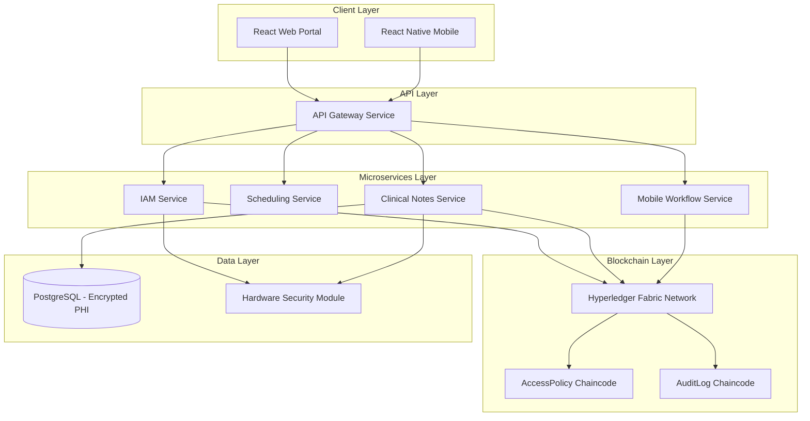
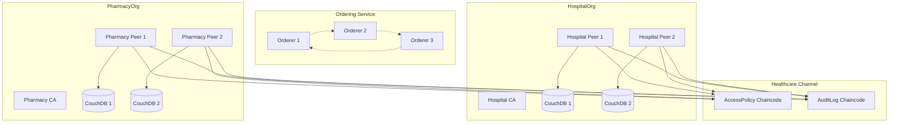

# Medrex DLT EMR System Design

## Overview

The Medrex DLT EMR system implements a hybrid blockchain architecture using Hyperledger Fabric for access control and audit trails while maintaining PHI in encrypted off-chain storage. The system follows a microservices architecture with Go-based services, React/React Native frontends, and comprehensive RBAC enforcement.

## Architecture

### High-Level Architecture



### Hyperledger Fabric Network Architecture



## Components and Interfaces

### 1. API Gateway Service

**Purpose**: Single entry point for all client requests with authentication, authorization, and routing.

**Key Responsibilities**:
- OAuth 2.0/JWT token validation
- Rate limiting and throttling
- Request routing to appropriate microservices
- Response aggregation and transformation
- Security headers and CORS handling

**Interfaces**:
```go
type APIGateway interface {
    ValidateToken(token string) (*UserClaims, error)
    RouteRequest(req *http.Request) (*http.Response, error)
    ApplyRateLimit(userID string) error
    LogRequest(req *http.Request, resp *http.Response)
}

type UserClaims struct {
    UserID   string   `json:"user_id"`
    Role     string   `json:"role"`
    OrgID    string   `json:"org_id"`
    Permissions []string `json:"permissions"`
}
```

### 2. IAM Service

**Purpose**: Identity and access management with Hyperledger Fabric MSP integration.

**Key Responsibilities**:
- User registration and enrollment
- Multi-factor authentication
- X.509 certificate management
- Role-based permission validation
- Integration with Fabric CAs

**Interfaces**:
```go
type IAMService interface {
    RegisterUser(req *UserRegistrationRequest) (*User, error)
    AuthenticateUser(credentials *Credentials) (*AuthToken, error)
    ValidatePermissions(userID, resource, action string) (bool, error)
    EnrollWithFabricCA(userID string) (*X509Certificate, error)
    RefreshToken(token string) (*AuthToken, error)
}

type User struct {
    ID           string    `json:"id"`
    Username     string    `json:"username"`
    Role         UserRole  `json:"role"`
    Organization string    `json:"organization"`
    Certificate  string    `json:"certificate"`
    CreatedAt    time.Time `json:"created_at"`
}

type UserRole string
const (
    RolePatient           UserRole = "patient"
    RoleMBBSStudent      UserRole = "mbbs_student"
    RoleMDStudent        UserRole = "md_student"
    RoleConsultingDoctor UserRole = "consulting_doctor"
    RoleNurse            UserRole = "nurse"
    RoleLabTechnician    UserRole = "lab_technician"
    RoleReceptionist     UserRole = "receptionist"
    RoleClinicalStaff    UserRole = "clinical_staff"
    RoleAdministrator    UserRole = "administrator"
)
```

### 3. Clinical Notes Service

**Purpose**: Secure management of PHI data with blockchain-based access control.

**Key Responsibilities**:
- PHI encryption/decryption using PRE
- Integration with AccessPolicy chaincode
- Secure database operations
- Data integrity verification
- Audit trail integration

**Interfaces**:
```go
type ClinicalNotesService interface {
    CreateNote(note *ClinicalNote, userID string) (*ClinicalNote, error)
    GetNote(noteID, userID string) (*ClinicalNote, error)
    UpdateNote(noteID string, updates *NoteUpdates, userID string) error
    DeleteNote(noteID, userID string) error
    SearchNotes(criteria *SearchCriteria, userID string) ([]*ClinicalNote, error)
}

type ClinicalNote struct {
    ID          string            `json:"id"`
    PatientID   string            `json:"patient_id"`
    AuthorID    string            `json:"author_id"`
    Content     string            `json:"content"` // Encrypted
    Hash        string            `json:"hash"`    // SHA-256 hash
    Metadata    map[string]string `json:"metadata"`
    CreatedAt   time.Time         `json:"created_at"`
    UpdatedAt   time.Time         `json:"updated_at"`
}
```

### 4. Scheduling Service

**Purpose**: Appointment and resource management with role-based access.

**Key Responsibilities**:
- Appointment scheduling and management
- Resource availability tracking
- Calendar integration
- Notification management
- Conflict resolution

**Interfaces**:
```go
type SchedulingService interface {
    CreateAppointment(apt *Appointment, userID string) (*Appointment, error)
    GetAppointments(userID string, filters *AppointmentFilters) ([]*Appointment, error)
    UpdateAppointment(aptID string, updates *AppointmentUpdates, userID string) error
    CancelAppointment(aptID, userID string) error
    CheckAvailability(providerID string, timeSlot *TimeSlot) (bool, error)
}

type Appointment struct {
    ID          string    `json:"id"`
    PatientID   string    `json:"patient_id"`
    ProviderID  string    `json:"provider_id"`
    StartTime   time.Time `json:"start_time"`
    EndTime     time.Time `json:"end_time"`
    Type        string    `json:"type"`
    Status      string    `json:"status"`
    Notes       string    `json:"notes"`
}
```

### 5. Mobile Workflow Service

**Purpose**: Optimized APIs for mobile applications with CPOE and scanning workflows.

**Key Responsibilities**:
- Mobile-optimized API endpoints
- CPOE workflow management
- Barcode/QR code scanning integration
- Consultant co-signature workflows
- Offline synchronization support

**Interfaces**:
```go
type MobileWorkflowService interface {
    CreateOrder(order *CPOEOrder, userID string) (*CPOEOrder, error)
    RequestCoSignature(orderID, consultantID string) error
    ApproveOrder(orderID, consultantID string) error
    ScanBarcode(barcode string, userID string) (*ScanResult, error)
    SyncOfflineData(data *OfflineData, userID string) error
}

type CPOEOrder struct {
    ID            string    `json:"id"`
    PatientID     string    `json:"patient_id"`
    OrderingMD    string    `json:"ordering_md"`
    CoSigningMD   string    `json:"co_signing_md,omitempty"`
    OrderType     string    `json:"order_type"`
    Details       string    `json:"details"`
    Status        string    `json:"status"`
    RequiresCoSign bool     `json:"requires_co_sign"`
    CreatedAt     time.Time `json:"created_at"`
}
```

## Data Models

### Blockchain Data Models

**AccessPolicy Structure**:
```go
type AccessPolicy struct {
    ID           string            `json:"id"`
    ResourceType string            `json:"resource_type"`
    UserRole     string            `json:"user_role"`
    Actions      []string          `json:"actions"`
    Conditions   map[string]string `json:"conditions"`
    CreatedBy    string            `json:"created_by"`
    CreatedAt    time.Time         `json:"created_at"`
}
```

**AuditLog Structure**:
```go
type AuditLogEntry struct {
    ID         string                 `json:"id"`
    UserID     string                 `json:"user_id"`
    Action     string                 `json:"action"`
    ResourceID string                 `json:"resource_id"`
    Timestamp  time.Time              `json:"timestamp"`
    Success    bool                   `json:"success"`
    Details    map[string]interface{} `json:"details"`
    Signature  string                 `json:"signature"`
}
```

### Off-Chain Data Models

**Patient Record**:
```go
type Patient struct {
    ID           string    `json:"id"`
    MRN          string    `json:"mrn"` // Medical Record Number
    Demographics *Demographics `json:"demographics"`
    Insurance    *Insurance    `json:"insurance"`
    CreatedAt    time.Time     `json:"created_at"`
    UpdatedAt    time.Time     `json:"updated_at"`
}

type Demographics struct {
    FirstName   string    `json:"first_name"`
    LastName    string    `json:"last_name"`
    DateOfBirth time.Time `json:"date_of_birth"`
    Gender      string    `json:"gender"`
    Address     *Address  `json:"address"`
    Phone       string    `json:"phone"`
    Email       string    `json:"email"`
}
```

## Error Handling

### Error Classification

```go
type ErrorType string

const (
    ErrorTypeValidation    ErrorType = "validation"
    ErrorTypeAuthorization ErrorType = "authorization"
    ErrorTypeNotFound      ErrorType = "not_found"
    ErrorTypeInternal      ErrorType = "internal"
    ErrorTypeExternal      ErrorType = "external"
    ErrorTypeCompliance    ErrorType = "compliance"
)

type MedrexError struct {
    Type    ErrorType `json:"type"`
    Code    string    `json:"code"`
    Message string    `json:"message"`
    Details map[string]interface{} `json:"details,omitempty"`
}
```

### Error Handling Strategy

1. **Validation Errors**: Return 400 Bad Request with detailed field errors
2. **Authorization Errors**: Return 403 Forbidden with minimal information
3. **Not Found Errors**: Return 404 Not Found with generic message
4. **Internal Errors**: Return 500 Internal Server Error, log detailed information
5. **Compliance Errors**: Return 422 Unprocessable Entity with compliance details

### Circuit Breaker Pattern

Implement circuit breakers for external service calls:
- Hyperledger Fabric network calls
- HSM service calls
- Database connections
- Third-party API integrations

## Testing Strategy

### Unit Testing

**Coverage Requirements**: Minimum 85% code coverage across all microservices

**Test Categories**:
- Business logic validation
- Error handling scenarios
- Security function testing
- Data transformation testing

**Mock Strategy**:
```go
type MockFabricClient struct {
    responses map[string]interface{}
    errors    map[string]error
}

func (m *MockFabricClient) InvokeChaincode(chaincode, function string, args []string) ([]byte, error) {
    if err, exists := m.errors[function]; exists {
        return nil, err
    }
    if resp, exists := m.responses[function]; exists {
        return json.Marshal(resp)
    }
    return nil, fmt.Errorf("mock response not configured for %s", function)
}
```

### Integration Testing

**Fabric Network Testing**:
- Chaincode deployment and invocation
- Multi-organization transaction flows
- Certificate authority integration
- Consensus mechanism validation

**Database Integration**:
- Encryption/decryption workflows
- Transaction rollback scenarios
- Connection pool management
- Performance under load

### Security Testing

**Authentication Testing**:
- JWT token validation
- Certificate-based authentication
- Multi-factor authentication flows
- Session management

**Authorization Testing**:
- RBAC policy enforcement
- Cross-organization access controls
- Privilege escalation prevention
- Resource-level permissions

**Compliance Testing**:
- PHI access logging
- Audit trail completeness
- Data encryption validation
- HIPAA/GDPR compliance verification

### Performance Testing

**Load Testing Scenarios**:
- Concurrent user authentication
- High-volume PHI access requests
- Blockchain transaction throughput
- Database query performance

**Stress Testing**:
- Network partition scenarios
- Database connection exhaustion
- Memory and CPU resource limits
- Chaincode execution timeouts

### End-to-End Testing

**User Journey Testing**:
- Patient registration and login
- Physician CPOE workflows
- Student supervision workflows
- Administrative user management

**Cross-Service Integration**:
- API Gateway routing
- Service-to-service communication
- Blockchain state consistency
- Audit trail correlation

## Deployment Architecture

### Container Strategy

All services will be containerized using Docker with multi-stage builds:

```dockerfile
# Example Dockerfile structure
FROM golang:1.21-alpine AS builder
WORKDIR /app
COPY go.mod go.sum ./
RUN go mod download
COPY . .
RUN CGO_ENABLED=0 GOOS=linux go build -o main .

FROM alpine:latest
RUN apk --no-cache add ca-certificates
WORKDIR /root/
COPY --from=builder /app/main .
CMD ["./main"]
```

### Kubernetes Deployment

**Namespace Strategy**:
- `medrex-fabric`: Hyperledger Fabric network components
- `medrex-services`: Application microservices
- `medrex-data`: Database and storage components

**Resource Requirements**:
- CPU: 2-4 cores per service
- Memory: 4-8 GB per service
- Storage: High-IOPS SSD for database and blockchain state

### Infrastructure as Code

**Terraform Modules**:
- VPC and networking configuration
- Kubernetes cluster provisioning
- Database instance creation
- HSM service configuration
- Load balancer and ingress setup

**Helm Charts**:
- Hyperledger Fabric network deployment
- Microservices deployment
- Monitoring and logging stack
- Backup and recovery services