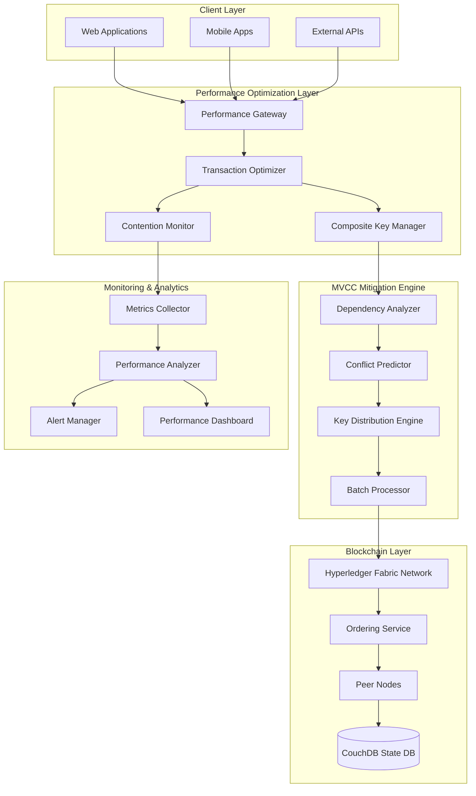
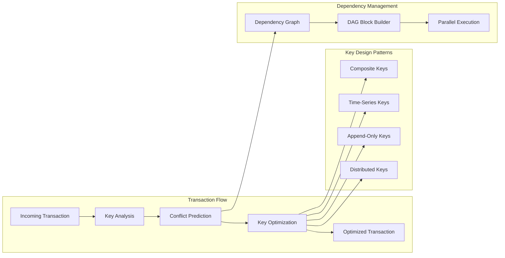

# Performance Optimization System Design

## Overview

The Performance Optimization System addresses the critical challenge of achieving 1000+ TPS throughput in the Medrex V2.0 platform by implementing sophisticated MVCC conflict mitigation strategies, composite key design patterns, and dependency-aware transaction processing. The system focuses on maximizing transaction goodput while maintaining data consistency and security in high-contention healthcare environments.

## Architecture

### High-Level Architecture



### MVCC Conflict Mitigation Architecture



## Components and Interfaces

### 1. Transaction Optimizer

**Purpose**: Central component for optimizing transaction processing and minimizing MVCC conflicts.

**Key Responsibilities**:
- Transaction analysis and optimization
- Key conflict prediction and avoidance
- Batch processing coordination
- Performance metrics collection
- Dynamic optimization based on patterns

**Interfaces**:
```go
type TransactionOptimizer interface {
    OptimizeTransaction(ctx context.Context, tx *Transaction) (*OptimizedTransaction, error)
    PredictConflicts(ctx context.Context, txBatch []*Transaction) (*ConflictPrediction, error)
    GetOptimizationRecommendations(ctx context.Context, pattern *AccessPattern) (*OptimizationRecommendations, error)
    UpdateOptimizationStrategy(ctx context.Context, strategy *OptimizationStrategy) error
    GetPerformanceMetrics(ctx context.Context, timeRange *TimeRange) (*PerformanceMetrics, error)
}

type Transaction struct {
    ID          string            `json:"id"`
    Type        string            `json:"type"`
    ReadSet     []string          `json:"read_set"`
    WriteSet    []string          `json:"write_set"`
    Payload     []byte            `json:"payload"`
    Timestamp   time.Time         `json:"timestamp"`
    Priority    int               `json:"priority"`
    Metadata    map[string]string `json:"metadata"`
}

type OptimizedTransaction struct {
    Original        *Transaction      `json:"original"`
    OptimizedKeys   map[string]string `json:"optimized_keys"`
    BatchGroup      string            `json:"batch_group"`
    Dependencies    []string          `json:"dependencies"`
    EstimatedDelay  time.Duration     `json:"estimated_delay"`
    OptimizationLog []string          `json:"optimization_log"`
}

type ConflictPrediction struct {
    ConflictProbability float64           `json:"conflict_probability"`
    ConflictingKeys     []string          `json:"conflicting_keys"`
    RecommendedDelay    time.Duration     `json:"recommended_delay"`
    AlternativeKeys     map[string]string `json:"alternative_keys"`
    BatchingOpportunity bool              `json:"batching_opportunity"`
}
```

### 2. Composite Key Manager

**Purpose**: Implements intelligent key design strategies to minimize MVCC conflicts.

**Key Responsibilities**:
- Composite key generation and management
- Key distribution strategies
- Time-series key patterns
- Append-only key optimization
- Key conflict analysis

**Interfaces**:
```go
type CompositeKeyManager interface {
    GenerateCompositeKey(ctx context.Context, req *KeyGenerationRequest) (string, error)
    AnalyzeKeyContention(ctx context.Context, keys []string) (*ContentionAnalysis, error)
    RecommendKeyOptimization(ctx context.Context, pattern *AccessPattern) (*KeyOptimization, error)
    GetKeyDistributionStrategy(ctx context.Context, dataType string) (*DistributionStrategy, error)
    ValidateKeyDesign(ctx context.Context, keyPattern string) (*ValidationResult, error)
}

type KeyGenerationRequest struct {
    DataType    string            `json:"data_type"`
    EntityID    string            `json:"entity_id"`
    Operation   string            `json:"operation"`
    Timestamp   time.Time         `json:"timestamp"`
    Attributes  map[string]string `json:"attributes"`
    Strategy    string            `json:"strategy"`
}

type ContentionAnalysis struct {
    HighContentionKeys []ContentionInfo `json:"high_contention_keys"`
    ConflictRate       float64          `json:"conflict_rate"`
    ThroughputImpact   float64          `json:"throughput_impact"`
    Recommendations    []string         `json:"recommendations"`
    OptimizationScore  float64          `json:"optimization_score"`
}

type ContentionInfo struct {
    Key           string    `json:"key"`
    ConflictCount int       `json:"conflict_count"`
    AccessRate    float64   `json:"access_rate"`
    LastConflict  time.Time `json:"last_conflict"`
    Pattern       string    `json:"pattern"`
}

// Key design patterns for different data types
type KeyPattern struct {
    DataType    string `json:"data_type"`
    Pattern     string `json:"pattern"`
    Description string `json:"description"`
    Example     string `json:"example"`
}

var HealthcareKeyPatterns = []KeyPattern{
    {
        DataType:    "patient_master_hash",
        Pattern:     "PMH:{PatientID}",
        Description: "Low volatility patient master record hash",
        Example:     "PMH:P123456",
    },
    {
        DataType:    "financial_balance",
        Pattern:     "FINANCE:{PatientID}:BALANCE:{Timestamp}",
        Description: "High volatility financial data with timestamp separation",
        Example:     "FINANCE:P123456:BALANCE:1640995200",
    },
    {
        DataType:    "vital_signs",
        Pattern:     "VITAL:{PatientID}:{DeviceID}:{Timestamp}",
        Description: "Very high volatility vitals with device and time separation",
        Example:     "VITAL:P123456:MONITOR01:1640995200",
    },
    {
        DataType:    "appointment",
        Pattern:     "APPOINTMENT:{ApptID}:{Status}",
        Description: "Moderate volatility appointment data with status separation",
        Example:     "APPOINTMENT:A789012:SCHEDULED",
    },
    {
        DataType:    "audit_log",
        Pattern:     "AUDIT:{UserID}:{Action}:{Timestamp}",
        Description: "Append-only audit entries with user and action separation",
        Example:     "AUDIT:U456789:LOGIN:1640995200",
    },
}
```

### 3. Dependency Analyzer

**Purpose**: Analyzes transaction dependencies and optimizes block construction.

**Key Responsibilities**:
- Transaction dependency graph construction
- DAG-based block optimization
- Parallel execution planning
- Dependency conflict resolution
- Performance impact analysis

**Interfaces**:
```go
type DependencyAnalyzer interface {
    AnalyzeDependencies(ctx context.Context, transactions []*Transaction) (*DependencyGraph, error)
    BuildDAGBlock(ctx context.Context, graph *DependencyGraph) (*DAGBlock, error)
    OptimizeExecutionOrder(ctx context.Context, transactions []*Transaction) (*ExecutionPlan, error)
    DetectCircularDependencies(ctx context.Context, graph *DependencyGraph) ([]string, error)
    GetParallelizationOpportunities(ctx context.Context, graph *DependencyGraph) (*ParallelizationPlan, error)
}

type DependencyGraph struct {
    Nodes map[string]*DependencyNode `json:"nodes"`
    Edges map[string][]string        `json:"edges"`
    Levels [][]string                `json:"levels"`
    MaxParallelism int               `json:"max_parallelism"`
}

type DependencyNode struct {
    TransactionID string            `json:"transaction_id"`
    ReadSet       []string          `json:"read_set"`
    WriteSet      []string          `json:"write_set"`
    Dependencies  []string          `json:"dependencies"`
    Level         int               `json:"level"`
    CanParallelize bool             `json:"can_parallelize"`
    Metadata      map[string]string `json:"metadata"`
}

type DAGBlock struct {
    BlockID       string              `json:"block_id"`
    Transactions  []*Transaction      `json:"transactions"`
    ExecutionPlan *ExecutionPlan      `json:"execution_plan"`
    Dependencies  *DependencyGraph    `json:"dependencies"`
    Timestamp     time.Time           `json:"timestamp"`
    Metadata      map[string]string   `json:"metadata"`
}

type ExecutionPlan struct {
    Phases        []ExecutionPhase    `json:"phases"`
    TotalPhases   int                 `json:"total_phases"`
    EstimatedTime time.Duration       `json:"estimated_time"`
    Parallelism   int                 `json:"parallelism"`
}

type ExecutionPhase struct {
    PhaseID       int          `json:"phase_id"`
    Transactions  []string     `json:"transactions"`
    CanParallelize bool        `json:"can_parallelize"`
    EstimatedTime time.Duration `json:"estimated_time"`
}
```

### 4. Contention Monitor

**Purpose**: Real-time monitoring and analysis of transaction contention patterns.

**Key Responsibilities**:
- Real-time contention tracking
- Performance metrics collection
- Alert generation and management
- Trend analysis and prediction
- Optimization recommendations

**Interfaces**:
```go
type ContentionMonitor interface {
    StartMonitoring(ctx context.Context) error
    StopMonitoring(ctx context.Context) error
    GetContentionMetrics(ctx context.Context, timeRange *TimeRange) (*ContentionMetrics, error)
    GetRealTimeStats(ctx context.Context) (*RealTimeStats, error)
    SetAlertThresholds(ctx context.Context, thresholds *AlertThresholds) error
    GetOptimizationRecommendations(ctx context.Context) (*OptimizationRecommendations, error)
}

type ContentionMetrics struct {
    TotalTransactions    int64     `json:"total_transactions"`
    SuccessfulTransactions int64   `json:"successful_transactions"`
    ConflictedTransactions int64   `json:"conflicted_transactions"`
    ConflictRate         float64   `json:"conflict_rate"`
    AverageLatency       float64   `json:"average_latency"`
    ThroughputTPS        float64   `json:"throughput_tps"`
    GoodputPercentage    float64   `json:"goodput_percentage"`
    TopContentionKeys    []ContentionInfo `json:"top_contention_keys"`
    TimeRange            *TimeRange `json:"time_range"`
}

type RealTimeStats struct {
    CurrentTPS           float64   `json:"current_tps"`
    CurrentConflictRate  float64   `json:"current_conflict_rate"`
    ActiveTransactions   int       `json:"active_transactions"`
    PendingTransactions  int       `json:"pending_transactions"`
    AverageBlockTime     float64   `json:"average_block_time"`
    LastBlockSize        int       `json:"last_block_size"`
    Timestamp            time.Time `json:"timestamp"`
}

type AlertThresholds struct {
    MaxConflictRate      float64 `json:"max_conflict_rate"`      // 0.05 (5%)
    MinThroughputTPS     float64 `json:"min_throughput_tps"`     // 1000
    MaxAverageLatency    float64 `json:"max_average_latency"`    // 1.0 second
    MinGoodputPercentage float64 `json:"min_goodput_percentage"` // 0.95 (95%)
}
```

## Data Models

### Performance Metrics Model

```go
type PerformanceMetrics struct {
    Timestamp            time.Time `json:"timestamp"`
    ThroughputTPS        float64   `json:"throughput_tps"`
    GoodputPercentage    float64   `json:"goodput_percentage"`
    AverageLatency       float64   `json:"average_latency"`
    P95Latency           float64   `json:"p95_latency"`
    P99Latency           float64   `json:"p99_latency"`
    ConflictRate         float64   `json:"conflict_rate"`
    BlockProductionRate  float64   `json:"block_production_rate"`
    AverageBlockSize     int       `json:"average_block_size"`
    EndorsementTime      float64   `json:"endorsement_time"`
    OrderingTime         float64   `json:"ordering_time"`
    ValidationTime       float64   `json:"validation_time"`
    CommitTime           float64   `json:"commit_time"`
    CouchDBQueryTime     float64   `json:"couchdb_query_time"`
    NetworkLatency       float64   `json:"network_latency"`
}

type OptimizationStrategy struct {
    ID                   string            `json:"id"`
    Name                 string            `json:"name"`
    Description          string            `json:"description"`
    KeyOptimizations     []KeyOptimization `json:"key_optimizations"`
    BatchingRules        []BatchingRule    `json:"batching_rules"`
    DependencyRules      []DependencyRule  `json:"dependency_rules"`
    PerformanceTargets   *PerformanceTargets `json:"performance_targets"`
    Enabled              bool              `json:"enabled"`
    Priority             int               `json:"priority"`
}

type KeyOptimization struct {
    DataType            string `json:"data_type"`
    OriginalPattern     string `json:"original_pattern"`
    OptimizedPattern    string `json:"optimized_pattern"`
    ExpectedImprovement float64 `json:"expected_improvement"`
    RiskLevel           string `json:"risk_level"`
}

type BatchingRule struct {
    TransactionType     string        `json:"transaction_type"`
    MaxBatchSize        int           `json:"max_batch_size"`
    MaxWaitTime         time.Duration `json:"max_wait_time"`
    BatchingCriteria    []string      `json:"batching_criteria"`
}

type DependencyRule struct {
    SourceType          string `json:"source_type"`
    TargetType          string `json:"target_type"`
    DependencyType      string `json:"dependency_type"`
    ResolutionStrategy  string `json:"resolution_strategy"`
}

type PerformanceTargets struct {
    MinThroughputTPS    float64 `json:"min_throughput_tps"`
    MaxConflictRate     float64 `json:"max_conflict_rate"`
    MaxAverageLatency   float64 `json:"max_average_latency"`
    MinGoodputPercentage float64 `json:"min_goodput_percentage"`
}
```

### Optimization Recommendations Model

```go
type OptimizationRecommendations struct {
    GeneratedAt         time.Time                    `json:"generated_at"`
    OverallScore        float64                      `json:"overall_score"`
    KeyOptimizations    []KeyOptimizationRecommendation `json:"key_optimizations"`
    BatchingOpportunities []BatchingOpportunity      `json:"batching_opportunities"`
    InfrastructureChanges []InfrastructureRecommendation `json:"infrastructure_changes"`
    ConfigurationTuning []ConfigurationRecommendation `json:"configuration_tuning"`
    PriorityActions     []string                     `json:"priority_actions"`
}

type KeyOptimizationRecommendation struct {
    CurrentKey          string  `json:"current_key"`
    RecommendedKey      string  `json:"recommended_key"`
    ConflictReduction   float64 `json:"conflict_reduction"`
    ThroughputImprovement float64 `json:"throughput_improvement"`
    ImplementationRisk  string  `json:"implementation_risk"`
    EstimatedEffort     string  `json:"estimated_effort"`
}

type BatchingOpportunity struct {
    TransactionPattern  string        `json:"transaction_pattern"`
    CurrentBatchSize    int           `json:"current_batch_size"`
    RecommendedBatchSize int          `json:"recommended_batch_size"`
    ExpectedImprovement float64       `json:"expected_improvement"`
    MaxWaitTime         time.Duration `json:"max_wait_time"`
}

type InfrastructureRecommendation struct {
    Component           string `json:"component"`
    CurrentConfiguration string `json:"current_configuration"`
    RecommendedConfiguration string `json:"recommended_configuration"`
    ExpectedImprovement float64 `json:"expected_improvement"`
    Cost                string `json:"cost"`
}
```

## Error Handling

### Performance-Specific Error Types

```go
type PerformanceErrorType string

const (
    ErrorTypeHighContention     PerformanceErrorType = "high_contention"
    ErrorTypeThroughputDegraded PerformanceErrorType = "throughput_degraded"
    ErrorTypeLatencyExceeded    PerformanceErrorType = "latency_exceeded"
    ErrorTypeOptimizationFailed PerformanceErrorType = "optimization_failed"
    ErrorTypeDependencyCycle    PerformanceErrorType = "dependency_cycle"
    ErrorTypeResourceExhausted  PerformanceErrorType = "resource_exhausted"
)

type PerformanceError struct {
    Type            PerformanceErrorType `json:"type"`
    Code            string               `json:"code"`
    Message         string               `json:"message"`
    CurrentMetrics  *PerformanceMetrics  `json:"current_metrics"`
    Recommendations []string             `json:"recommendations"`
    Severity        string               `json:"severity"`
    Timestamp       time.Time            `json:"timestamp"`
}
```

## Testing Strategy

### Performance Testing

**Load Testing Framework**:
```go
type LoadTestConfig struct {
    Duration            time.Duration `json:"duration"`
    TargetTPS           int           `json:"target_tps"`
    RampUpTime          time.Duration `json:"ramp_up_time"`
    TransactionMix      map[string]float64 `json:"transaction_mix"`
    ContentionLevel     string        `json:"contention_level"`
    NetworkLatency      time.Duration `json:"network_latency"`
}

func RunLoadTest(config *LoadTestConfig) (*LoadTestResults, error) {
    // Implement comprehensive load testing
    // Simulate realistic healthcare transaction patterns
    // Measure MVCC conflicts under various loads
    // Validate performance targets
    return &LoadTestResults{}, nil
}

type LoadTestResults struct {
    AchievedTPS         float64                `json:"achieved_tps"`
    ConflictRate        float64                `json:"conflict_rate"`
    AverageLatency      float64                `json:"average_latency"`
    P95Latency          float64                `json:"p95_latency"`
    P99Latency          float64                `json:"p99_latency"`
    GoodputPercentage   float64                `json:"goodput_percentage"`
    ResourceUtilization *ResourceUtilization   `json:"resource_utilization"`
    BottleneckAnalysis  *BottleneckAnalysis    `json:"bottleneck_analysis"`
}
```

**MVCC Conflict Testing**:
```go
func TestMVCCConflictMitigation(t *testing.T) {
    // Test high-contention scenarios
    scenarios := []struct {
        name            string
        transactionType string
        concurrency     int
        expectedConflictRate float64
    }{
        {
            name:            "patient_vitals_high_frequency",
            transactionType: "vital_signs",
            concurrency:     100,
            expectedConflictRate: 0.02, // 2% with optimization
        },
        {
            name:            "financial_updates_moderate",
            transactionType: "financial_balance",
            concurrency:     50,
            expectedConflictRate: 0.05, // 5% with optimization
        },
    }
    
    for _, scenario := range scenarios {
        t.Run(scenario.name, func(t *testing.T) {
            results := runConcurrentTransactions(scenario.transactionType, scenario.concurrency)
            assert.LessOrEqual(t, results.ConflictRate, scenario.expectedConflictRate)
        })
    }
}
```

### Benchmark Testing

```go
func BenchmarkKeyOptimization(b *testing.B) {
    keyManager := NewCompositeKeyManager()
    
    b.Run("original_key_pattern", func(b *testing.B) {
        for i := 0; i < b.N; i++ {
            key := fmt.Sprintf("PATIENT:%d", i)
            // Simulate transaction with original key
            _ = simulateTransaction(key)
        }
    })
    
    b.Run("optimized_key_pattern", func(b *testing.B) {
        for i := 0; i < b.N; i++ {
            key := keyManager.GenerateCompositeKey(context.Background(), &KeyGenerationRequest{
                DataType:  "patient_vitals",
                EntityID:  fmt.Sprintf("%d", i),
                Timestamp: time.Now(),
                Strategy:  "time_series",
            })
            // Simulate transaction with optimized key
            _ = simulateTransaction(key)
        }
    })
}
```

## Deployment Architecture

### Kubernetes Deployment

```yaml
apiVersion: apps/v1
kind: Deployment
metadata:
  name: performance-optimizer
  namespace: medrex-services
spec:
  replicas: 3
  selector:
    matchLabels:
      app: performance-optimizer
  template:
    metadata:
      labels:
        app: performance-optimizer
    spec:
      containers:
      - name: optimizer
        image: medrex/performance-optimizer:latest
        ports:
        - containerPort: 8080
        - containerPort: 9090  # Metrics port
        env:
        - name: TARGET_TPS
          value: "1000"
        - name: MAX_CONFLICT_RATE
          value: "0.05"
        - name: OPTIMIZATION_INTERVAL
          value: "30s"
        - name: METRICS_RETENTION
          value: "7d"
        resources:
          requests:
            memory: "1Gi"
            cpu: "500m"
          limits:
            memory: "2Gi"
            cpu: "1000m"
        livenessProbe:
          httpGet:
            path: /health
            port: 8080
          initialDelaySeconds: 30
          periodSeconds: 10
        readinessProbe:
          httpGet:
            path: /ready
            port: 8080
          initialDelaySeconds: 5
          periodSeconds: 5
```

### Monitoring Configuration

```yaml
# Prometheus monitoring configuration
apiVersion: v1
kind: ConfigMap
metadata:
  name: performance-monitoring-config
data:
  prometheus.yml: |
    global:
      scrape_interval: 15s
    
    scrape_configs:
    - job_name: 'performance-optimizer'
      static_configs:
      - targets: ['performance-optimizer:9090']
      metrics_path: /metrics
      scrape_interval: 5s
    
    - job_name: 'fabric-peers'
      static_configs:
      - targets: ['peer0-hospital:9443', 'peer1-hospital:9443']
      metrics_path: /metrics
      scrape_interval: 10s
    
    rule_files:
    - "performance_alerts.yml"
    
  performance_alerts.yml: |
    groups:
    - name: performance.rules
      rules:
      - alert: HighConflictRate
        expr: mvcc_conflict_rate > 0.05
        for: 2m
        labels:
          severity: warning
        annotations:
          summary: "High MVCC conflict rate detected"
          description: "Conflict rate is {{ $value }}%, exceeding 5% threshold"
      
      - alert: LowThroughput
        expr: transaction_throughput_tps < 1000
        for: 5m
        labels:
          severity: critical
        annotations:
          summary: "Transaction throughput below target"
          description: "Current TPS is {{ $value }}, below 1000 TPS target"
```

This performance optimization system provides the sophisticated MVCC conflict mitigation and throughput optimization required to achieve enterprise-grade performance in high-contention healthcare environments.