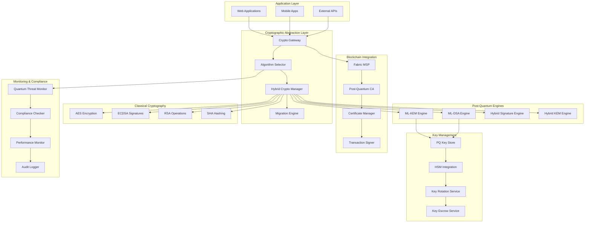
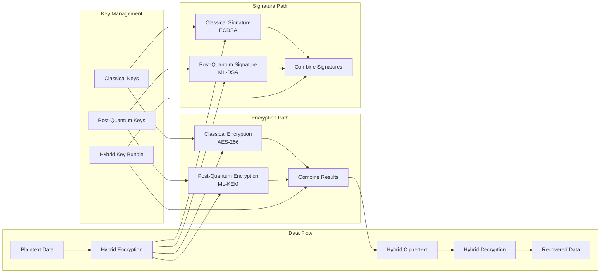

# Post-Quantum Cryptography System Design

## Overview

The Post-Quantum Cryptography System future-proofs the Medrex V2.0 platform against quantum computing threats by implementing quantum-resistant cryptographic algorithms, migration strategies, and hybrid cryptographic approaches. The system ensures long-term security of healthcare data spanning decades while maintaining performance and interoperability with existing systems.

## Architecture

### High-Level Architecture



### Hybrid Cryptography Architecture



## Components and Interfaces

### 1. Hybrid Crypto Manager

**Purpose**: Central component managing hybrid classical/post-quantum cryptographic operations.

**Key Responsibilities**:
- Hybrid encryption/decryption coordination
- Algorithm selection and policy enforcement
- Performance optimization for hybrid operations
- Backward compatibility management
- Security policy enforcement

**Interfaces**:
```go
type HybridCryptoManager interface {
    HybridEncrypt(ctx context.Context, data []byte, policy *CryptoPolicy) (*HybridCiphertext, error)
    HybridDecrypt(ctx context.Context, ciphertext *HybridCiphertext, keyBundle *HybridKeyBundle) ([]byte, error)
    HybridSign(ctx context.Context, data []byte, keyBundle *HybridKeyBundle) (*HybridSignature, error)
    HybridVerify(ctx context.Context, data []byte, signature *HybridSignature, keyBundle *HybridKeyBundle) (bool, error)
    GenerateHybridKeyPair(ctx context.Context, config *KeyGenerationConfig) (*HybridKeyBundle, error)
    UpdateCryptoPolicy(ctx context.Context, policy *CryptoPolicy) error
}

type HybridCiphertext struct {
    ClassicalCiphertext []byte            `json:"classical_ciphertext"`
    PQCiphertext       []byte            `json:"pq_ciphertext"`
    Algorithm          string            `json:"algorithm"`
    KeyID              string            `json:"key_id"`
    Metadata           map[string]string `json:"metadata"`
    Timestamp          time.Time         `json:"timestamp"`
}

type HybridSignature struct {
    ClassicalSignature []byte            `json:"classical_signature"`
    PQSignature       []byte            `json:"pq_signature"`
    Algorithm         string            `json:"algorithm"`
    KeyID             string            `json:"key_id"`
    Metadata          map[string]string `json:"metadata"`
    Timestamp         time.Time         `json:"timestamp"`
}

type HybridKeyBundle struct {
    ID                string                 `json:"id"`
    ClassicalKeys     *ClassicalKeyPair      `json:"classical_keys"`
    PQKeys           *PostQuantumKeyPair    `json:"pq_keys"`
    CryptoPolicy     *CryptoPolicy          `json:"crypto_policy"`
    CreatedAt        time.Time              `json:"created_at"`
    ExpiresAt        time.Time              `json:"expires_at"`
    Metadata         map[string]interface{} `json:"metadata"`
}

type CryptoPolicy struct {
    EncryptionAlgorithm string            `json:"encryption_algorithm"`
    SignatureAlgorithm  string            `json:"signature_algorithm"`
    HashAlgorithm       string            `json:"hash_algorithm"`
    KeyDerivation       string            `json:"key_derivation"`
    HybridMode          bool              `json:"hybrid_mode"`
    FallbackEnabled     bool              `json:"fallback_enabled"`
    SecurityLevel       int               `json:"security_level"`
    Attributes          map[string]string `json:"attributes"`
}
```

### 2. ML-KEM Engine

**Purpose**: Implements NIST ML-KEM (Machine Learning Key Encapsulation Mechanism) for quantum-resistant key exchange.

**Key Responsibilities**:
- ML-KEM key generation and management
- Key encapsulation and decapsulation
- Integration with hybrid key exchange
- Performance optimization
- Security parameter management

**Interfaces**:
```go
type MLKEMEngine interface {
    GenerateKeyPair(ctx context.Context, securityLevel int) (*MLKEMKeyPair, error)
    Encapsulate(ctx context.Context, publicKey *MLKEMPublicKey) (*MLKEMCiphertext, []byte, error)
    Decapsulate(ctx context.Context, ciphertext *MLKEMCiphertext, privateKey *MLKEMPrivateKey) ([]byte, error)
    ValidateKeyPair(ctx context.Context, keyPair *MLKEMKeyPair) error
    GetSecurityParameters(securityLevel int) (*SecurityParameters, error)
}

type MLKEMKeyPair struct {
    PublicKey  *MLKEMPublicKey  `json:"public_key"`
    PrivateKey *MLKEMPrivateKey `json:"private_key"`
    SecurityLevel int           `json:"security_level"`
    Algorithm  string          `json:"algorithm"`
    CreatedAt  time.Time       `json:"created_at"`
}

type MLKEMPublicKey struct {
    KeyData       []byte    `json:"key_data"`
    SecurityLevel int       `json:"security_level"`
    Algorithm     string    `json:"algorithm"`
    KeyID         string    `json:"key_id"`
    CreatedAt     time.Time `json:"created_at"`
}

type MLKEMPrivateKey struct {
    KeyData       []byte    `json:"key_data"`
    SecurityLevel int       `json:"security_level"`
    Algorithm     string    `json:"algorithm"`
    KeyID         string    `json:"key_id"`
    CreatedAt     time.Time `json:"created_at"`
}

type MLKEMCiphertext struct {
    CiphertextData []byte    `json:"ciphertext_data"`
    SecurityLevel  int       `json:"security_level"`
    Algorithm      string    `json:"algorithm"`
    KeyID          string    `json:"key_id"`
    Timestamp      time.Time `json:"timestamp"`
}

// Security levels for ML-KEM
const (
    MLKEM512  = 1 // Security level 1 (128-bit security)
    MLKEM768  = 3 // Security level 3 (192-bit security)
    MLKEM1024 = 5 // Security level 5 (256-bit security)
)
```

### 3. ML-DSA Engine

**Purpose**: Implements NIST ML-DSA (Machine Learning Digital Signature Algorithm) for quantum-resistant digital signatures.

**Key Responsibilities**:
- ML-DSA key generation and management
- Digital signature creation and verification
- Integration with hybrid signature schemes
- Performance optimization
- Security parameter management

**Interfaces**:
```go
type MLDSAEngine interface {
    GenerateKeyPair(ctx context.Context, securityLevel int) (*MLDSAKeyPair, error)
    Sign(ctx context.Context, message []byte, privateKey *MLDSAPrivateKey) (*MLDSASignature, error)
    Verify(ctx context.Context, message []byte, signature *MLDSASignature, publicKey *MLDSAPublicKey) (bool, error)
    ValidateKeyPair(ctx context.Context, keyPair *MLDSAKeyPair) error
    GetSecurityParameters(securityLevel int) (*SecurityParameters, error)
}

type MLDSAKeyPair struct {
    PublicKey     *MLDSAPublicKey  `json:"public_key"`
    PrivateKey    *MLDSAPrivateKey `json:"private_key"`
    SecurityLevel int              `json:"security_level"`
    Algorithm     string           `json:"algorithm"`
    CreatedAt     time.Time        `json:"created_at"`
}

type MLDSAPublicKey struct {
    KeyData       []byte    `json:"key_data"`
    SecurityLevel int       `json:"security_level"`
    Algorithm     string    `json:"algorithm"`
    KeyID         string    `json:"key_id"`
    CreatedAt     time.Time `json:"created_at"`
}

type MLDSAPrivateKey struct {
    KeyData       []byte    `json:"key_data"`
    SecurityLevel int       `json:"security_level"`
    Algorithm     string    `json:"algorithm"`
    KeyID         string    `json:"key_id"`
    CreatedAt     time.Time `json:"created_at"`
}

type MLDSASignature struct {
    SignatureData []byte    `json:"signature_data"`
    SecurityLevel int       `json:"security_level"`
    Algorithm     string    `json:"algorithm"`
    KeyID         string    `json:"key_id"`
    Timestamp     time.Time `json:"timestamp"`
}

// Security levels for ML-DSA
const (
    MLDSA44 = 2 // Security level 2 (128-bit security)
    MLDSA65 = 3 // Security level 3 (192-bit security)
    MLDSA87 = 5 // Security level 5 (256-bit security)
)
```

### 4. Migration Engine

**Purpose**: Manages migration from classical to post-quantum cryptographic algorithms.

**Key Responsibilities**:
- Migration planning and execution
- Backward compatibility maintenance
- Data re-encryption and re-signing
- Migration progress tracking
- Rollback capability

**Interfaces**:
```go
type MigrationEngine interface {
    CreateMigrationPlan(ctx context.Context, config *MigrationConfig) (*MigrationPlan, error)
    ExecuteMigration(ctx context.Context, plan *MigrationPlan) (*MigrationResult, error)
    GetMigrationStatus(ctx context.Context, migrationID string) (*MigrationStatus, error)
    RollbackMigration(ctx context.Context, migrationID string) error
    ValidateMigration(ctx context.Context, migrationID string) (*ValidationResult, error)
}

type MigrationConfig struct {
    SourceAlgorithm    string            `json:"source_algorithm"`
    TargetAlgorithm    string            `json:"target_algorithm"`
    MigrationStrategy  string            `json:"migration_strategy"`
    BatchSize          int               `json:"batch_size"`
    MaxDuration        time.Duration     `json:"max_duration"`
    BackupEnabled      bool              `json:"backup_enabled"`
    ValidationEnabled  bool              `json:"validation_enabled"`
    Attributes         map[string]string `json:"attributes"`
}

type MigrationPlan struct {
    ID                 string              `json:"id"`
    Config             *MigrationConfig    `json:"config"`
    Phases             []MigrationPhase    `json:"phases"`
    EstimatedDuration  time.Duration       `json:"estimated_duration"`
    RiskAssessment     *RiskAssessment     `json:"risk_assessment"`
    RollbackPlan       *RollbackPlan       `json:"rollback_plan"`
    CreatedAt          time.Time           `json:"created_at"`
}

type MigrationPhase struct {
    ID                 string        `json:"id"`
    Name               string        `json:"name"`
    Description        string        `json:"description"`
    Dependencies       []string      `json:"dependencies"`
    EstimatedDuration  time.Duration `json:"estimated_duration"`
    RiskLevel          string        `json:"risk_level"`
    ValidationSteps    []string      `json:"validation_steps"`
}

type MigrationStatus struct {
    MigrationID        string        `json:"migration_id"`
    CurrentPhase       string        `json:"current_phase"`
    Progress           float64       `json:"progress"`
    Status             string        `json:"status"`
    StartedAt          time.Time     `json:"started_at"`
    EstimatedCompletion time.Time    `json:"estimated_completion"`
    Errors             []string      `json:"errors"`
    Warnings           []string      `json:"warnings"`
}
```

### 5. Quantum Threat Monitor

**Purpose**: Monitors quantum computing advancement and assesses cryptographic vulnerability timelines.

**Key Responsibilities**:
- Quantum computing capability tracking
- Threat assessment and timeline prediction
- Algorithm vulnerability analysis
- Policy recommendation generation
- Automated alert management

**Interfaces**:
```go
type QuantumThreatMonitor interface {
    GetThreatAssessment(ctx context.Context) (*ThreatAssessment, error)
    UpdateThreatIntelligence(ctx context.Context, intelligence *ThreatIntelligence) error
    GetAlgorithmVulnerability(ctx context.Context, algorithm string) (*VulnerabilityAssessment, error)
    GenerateRecommendations(ctx context.Context) (*SecurityRecommendations, error)
    SetAlertThresholds(ctx context.Context, thresholds *ThreatThresholds) error
}

type ThreatAssessment struct {
    AssessmentDate     time.Time                    `json:"assessment_date"`
    OverallThreatLevel string                       `json:"overall_threat_level"`
    QuantumCapability  *QuantumCapabilityStatus     `json:"quantum_capability"`
    AlgorithmRisks     map[string]*AlgorithmRisk    `json:"algorithm_risks"`
    TimeToThreat       map[string]time.Duration     `json:"time_to_threat"`
    Recommendations    []string                     `json:"recommendations"`
    NextAssessment     time.Time                    `json:"next_assessment"`
}

type QuantumCapabilityStatus struct {
    LogicalQubits      int       `json:"logical_qubits"`
    ErrorRate          float64   `json:"error_rate"`
    CoherenceTime      float64   `json:"coherence_time"`
    GateOperations     int       `json:"gate_operations"`
    EstimatedProgress  float64   `json:"estimated_progress"`
    LastUpdated        time.Time `json:"last_updated"`
}

type AlgorithmRisk struct {
    Algorithm          string        `json:"algorithm"`
    CurrentSecurity    int           `json:"current_security"`
    QuantumVulnerable  bool          `json:"quantum_vulnerable"`
    TimeToBreak        time.Duration `json:"time_to_break"`
    ReplacementReady   bool          `json:"replacement_ready"`
    MigrationUrgency   string        `json:"migration_urgency"`
}

type SecurityRecommendations struct {
    GeneratedAt        time.Time                    `json:"generated_at"`
    PriorityActions    []RecommendationAction       `json:"priority_actions"`
    AlgorithmUpdates   []AlgorithmRecommendation    `json:"algorithm_updates"`
    MigrationTimeline  *MigrationTimeline           `json:"migration_timeline"`
    PolicyUpdates      []PolicyRecommendation       `json:"policy_updates"`
}

type RecommendationAction struct {
    Action             string        `json:"action"`
    Priority           string        `json:"priority"`
    Timeline           time.Duration `json:"timeline"`
    Description        string        `json:"description"`
    Impact             string        `json:"impact"`
    Effort             string        `json:"effort"`
}
```

## Data Models

### Cryptographic Configuration Model

```go
type CryptographicConfiguration struct {
    ID                 string                    `json:"id"`
    Name               string                    `json:"name"`
    Version            string                    `json:"version"`
    Algorithms         *AlgorithmConfiguration   `json:"algorithms"`
    SecurityPolicies   []SecurityPolicy          `json:"security_policies"`
    MigrationSettings  *MigrationSettings        `json:"migration_settings"`
    PerformanceTargets *PerformanceTargets       `json:"performance_targets"`
    ComplianceSettings *ComplianceSettings       `json:"compliance_settings"`
    LastUpdated        time.Time                 `json:"last_updated"`
}

type AlgorithmConfiguration struct {
    Encryption         *EncryptionConfig         `json:"encryption"`
    Signatures         *SignatureConfig          `json:"signatures"`
    KeyExchange        *KeyExchangeConfig        `json:"key_exchange"`
    Hashing            *HashingConfig            `json:"hashing"`
    KeyDerivation      *KeyDerivationConfig      `json:"key_derivation"`
}

type EncryptionConfig struct {
    Primary            string                    `json:"primary"`
    Fallback           []string                  `json:"fallback"`
    HybridMode         bool                      `json:"hybrid_mode"`
    SecurityLevel      int                       `json:"security_level"`
    Parameters         map[string]interface{}    `json:"parameters"`
}

type SignatureConfig struct {
    Primary            string                    `json:"primary"`
    Fallback           []string                  `json:"fallback"`
    HybridMode         bool                      `json:"hybrid_mode"`
    SecurityLevel      int                       `json:"security_level"`
    Parameters         map[string]interface{}    `json:"parameters"`
}

// Supported algorithms
const (
    // Classical algorithms
    AlgorithmAES256        = "AES-256"
    AlgorithmECDSA         = "ECDSA-P256"
    AlgorithmRSA2048       = "RSA-2048"
    AlgorithmSHA256        = "SHA-256"
    
    // Post-quantum algorithms
    AlgorithmMLKEM512      = "ML-KEM-512"
    AlgorithmMLKEM768      = "ML-KEM-768"
    AlgorithmMLKEM1024     = "ML-KEM-1024"
    AlgorithmMLDSA44       = "ML-DSA-44"
    AlgorithmMLDSA65       = "ML-DSA-65"
    AlgorithmMLDSA87       = "ML-DSA-87"
    
    // Hybrid algorithms
    AlgorithmHybridKEM     = "Hybrid-KEM"
    AlgorithmHybridDSA     = "Hybrid-DSA"
)
```

### Performance Metrics Model

```go
type CryptographicPerformanceMetrics struct {
    Timestamp          time.Time                 `json:"timestamp"`
    Algorithm          string                    `json:"algorithm"`
    Operation          string                    `json:"operation"`
    KeySize            int                       `json:"key_size"`
    SignatureSize      int                       `json:"signature_size"`
    CiphertextSize     int                       `json:"ciphertext_size"`
    KeyGenTime         time.Duration             `json:"key_gen_time"`
    EncryptionTime     time.Duration             `json:"encryption_time"`
    DecryptionTime     time.Duration             `json:"decryption_time"`
    SigningTime        time.Duration             `json:"signing_time"`
    VerificationTime   time.Duration             `json:"verification_time"`
    ThroughputOpsPerSec float64                  `json:"throughput_ops_per_sec"`
    MemoryUsage        int64                     `json:"memory_usage"`
    CPUUsage           float64                   `json:"cpu_usage"`
}

type PerformanceComparison struct {
    ClassicalMetrics   *CryptographicPerformanceMetrics `json:"classical_metrics"`
    PostQuantumMetrics *CryptographicPerformanceMetrics `json:"post_quantum_metrics"`
    HybridMetrics      *CryptographicPerformanceMetrics `json:"hybrid_metrics"`
    PerformanceRatio   *PerformanceRatio                `json:"performance_ratio"`
    Recommendations    []string                         `json:"recommendations"`
}

type PerformanceRatio struct {
    KeyGenRatio        float64 `json:"key_gen_ratio"`
    EncryptionRatio    float64 `json:"encryption_ratio"`
    DecryptionRatio    float64 `json:"decryption_ratio"`
    SigningRatio       float64 `json:"signing_ratio"`
    VerificationRatio  float64 `json:"verification_ratio"`
    SizeRatio          float64 `json:"size_ratio"`
    ThroughputRatio    float64 `json:"throughput_ratio"`
}
```

## Error Handling

### Post-Quantum Specific Error Types

```go
type PostQuantumErrorType string

const (
    ErrorTypeAlgorithmNotSupported PostQuantumErrorType = "algorithm_not_supported"
    ErrorTypeKeyGenerationFailed   PostQuantumErrorType = "key_generation_failed"
    ErrorTypeEncryptionFailed      PostQuantumErrorType = "encryption_failed"
    ErrorTypeDecryptionFailed      PostQuantumErrorType = "decryption_failed"
    ErrorTypeSignatureFailed       PostQuantumErrorType = "signature_failed"
    ErrorTypeVerificationFailed    PostQuantumErrorType = "verification_failed"
    ErrorTypeMigrationFailed       PostQuantumErrorType = "migration_failed"
    ErrorTypePerformanceDegraded   PostQuantumErrorType = "performance_degraded"
    ErrorTypeComplianceViolation   PostQuantumErrorType = "compliance_violation"
)

type PostQuantumError struct {
    Type               PostQuantumErrorType `json:"type"`
    Code               string               `json:"code"`
    Message            string               `json:"message"`
    Algorithm          string               `json:"algorithm"`
    Operation          string               `json:"operation"`
    SecurityLevel      int                  `json:"security_level"`
    PerformanceImpact  *PerformanceImpact   `json:"performance_impact"`
    Recommendations    []string             `json:"recommendations"`
    Timestamp          time.Time            `json:"timestamp"`
}

type PerformanceImpact struct {
    LatencyIncrease    float64 `json:"latency_increase"`
    ThroughputDecrease float64 `json:"throughput_decrease"`
    MemoryIncrease     float64 `json:"memory_increase"`
    CPUIncrease        float64 `json:"cpu_increase"`
}
```

## Testing Strategy

### Cryptographic Testing

**Algorithm Validation Testing**:
```go
func TestMLKEMKeyEncapsulation(t *testing.T) {
    engine := NewMLKEMEngine()
    
    securityLevels := []int{MLKEM512, MLKEM768, MLKEM1024}
    
    for _, level := range securityLevels {
        t.Run(fmt.Sprintf("security_level_%d", level), func(t *testing.T) {
            // Generate key pair
            keyPair, err := engine.GenerateKeyPair(context.Background(), level)
            assert.NoError(t, err)
            assert.NotNil(t, keyPair)
            
            // Test encapsulation
            ciphertext, sharedSecret1, err := engine.Encapsulate(context.Background(), keyPair.PublicKey)
            assert.NoError(t, err)
            assert.NotNil(t, ciphertext)
            assert.NotNil(t, sharedSecret1)
            
            // Test decapsulation
            sharedSecret2, err := engine.Decapsulate(context.Background(), ciphertext, keyPair.PrivateKey)
            assert.NoError(t, err)
            assert.Equal(t, sharedSecret1, sharedSecret2)
        })
    }
}

func TestHybridCryptography(t *testing.T) {
    manager := NewHybridCryptoManager()
    
    // Test hybrid encryption/decryption
    testData := []byte("sensitive healthcare data")
    
    policy := &CryptoPolicy{
        EncryptionAlgorithm: AlgorithmHybridKEM,
        SignatureAlgorithm:  AlgorithmHybridDSA,
        HybridMode:          true,
        SecurityLevel:       3,
    }
    
    // Generate hybrid key bundle
    keyBundle, err := manager.GenerateHybridKeyPair(context.Background(), &KeyGenerationConfig{
        SecurityLevel: 3,
        HybridMode:    true,
    })
    assert.NoError(t, err)
    
    // Test hybrid encryption
    ciphertext, err := manager.HybridEncrypt(context.Background(), testData, policy)
    assert.NoError(t, err)
    assert.NotNil(t, ciphertext.ClassicalCiphertext)
    assert.NotNil(t, ciphertext.PQCiphertext)
    
    // Test hybrid decryption
    decrypted, err := manager.HybridDecrypt(context.Background(), ciphertext, keyBundle)
    assert.NoError(t, err)
    assert.Equal(t, testData, decrypted)
}
```

**Performance Testing**:
```go
func BenchmarkPostQuantumOperations(b *testing.B) {
    mlkemEngine := NewMLKEMEngine()
    mldsaEngine := NewMLDSAEngine()
    
    b.Run("ML-KEM-768_KeyGen", func(b *testing.B) {
        for i := 0; i < b.N; i++ {
            _, err := mlkemEngine.GenerateKeyPair(context.Background(), MLKEM768)
            if err != nil {
                b.Fatal(err)
            }
        }
    })
    
    b.Run("ML-DSA-65_Sign", func(b *testing.B) {
        keyPair, _ := mldsaEngine.GenerateKeyPair(context.Background(), MLDSA65)
        message := []byte("test message")
        
        b.ResetTimer()
        for i := 0; i < b.N; i++ {
            _, err := mldsaEngine.Sign(context.Background(), message, keyPair.PrivateKey)
            if err != nil {
                b.Fatal(err)
            }
        }
    })
}
```

**Migration Testing**:
```go
func TestCryptographicMigration(t *testing.T) {
    migrationEngine := NewMigrationEngine()
    
    // Test migration from ECDSA to ML-DSA
    config := &MigrationConfig{
        SourceAlgorithm:   AlgorithmECDSA,
        TargetAlgorithm:   AlgorithmMLDSA65,
        MigrationStrategy: "phased",
        BatchSize:         100,
        BackupEnabled:     true,
        ValidationEnabled: true,
    }
    
    // Create migration plan
    plan, err := migrationEngine.CreateMigrationPlan(context.Background(), config)
    assert.NoError(t, err)
    assert.NotNil(t, plan)
    assert.Greater(t, len(plan.Phases), 0)
    
    // Execute migration
    result, err := migrationEngine.ExecuteMigration(context.Background(), plan)
    assert.NoError(t, err)
    assert.Equal(t, "completed", result.Status)
    
    // Validate migration
    validation, err := migrationEngine.ValidateMigration(context.Background(), plan.ID)
    assert.NoError(t, err)
    assert.True(t, validation.Success)
}
```

## Deployment Architecture

### Kubernetes Deployment

```yaml
apiVersion: apps/v1
kind: Deployment
metadata:
  name: post-quantum-crypto-service
  namespace: medrex-services
spec:
  replicas: 3
  selector:
    matchLabels:
      app: post-quantum-crypto-service
  template:
    metadata:
      labels:
        app: post-quantum-crypto-service
    spec:
      containers:
      - name: pq-crypto
        image: medrex/post-quantum-crypto:latest
        ports:
        - containerPort: 8080
        - containerPort: 9090  # Metrics port
        env:
        - name: LIBOQS_PATH
          value: "/usr/local/lib/liboqs"
        - name: DEFAULT_SECURITY_LEVEL
          value: "3"
        - name: HYBRID_MODE_ENABLED
          value: "true"
        - name: PERFORMANCE_MONITORING
          value: "true"
        - name: HSM_INTEGRATION_ENABLED
          value: "true"
        volumeMounts:
        - name: liboqs-lib
          mountPath: /usr/local/lib/liboqs
        - name: crypto-config
          mountPath: /etc/crypto
        - name: hsm-config
          mountPath: /etc/hsm
        resources:
          requests:
            memory: "2Gi"
            cpu: "1000m"
          limits:
            memory: "4Gi"
            cpu: "2000m"
        livenessProbe:
          httpGet:
            path: /health
            port: 8080
          initialDelaySeconds: 30
          periodSeconds: 10
        readinessProbe:
          httpGet:
            path: /ready
            port: 8080
          initialDelaySeconds: 10
          periodSeconds: 5
      volumes:
      - name: liboqs-lib
        configMap:
          name: liboqs-library
      - name: crypto-config
        configMap:
          name: crypto-configuration
      - name: hsm-config
        secret:
          secretName: hsm-credentials
```

### Configuration Management

```yaml
# Post-Quantum Cryptography Configuration
apiVersion: v1
kind: ConfigMap
metadata:
  name: crypto-configuration
data:
  crypto-config.yaml: |
    algorithms:
      encryption:
        primary: "ML-KEM-768"
        fallback: ["AES-256", "ML-KEM-512"]
        hybrid_mode: true
        security_level: 3
      
      signatures:
        primary: "ML-DSA-65"
        fallback: ["ECDSA-P256", "ML-DSA-44"]
        hybrid_mode: true
        security_level: 3
      
      key_exchange:
        primary: "Hybrid-KEM"
        classical_component: "ECDH-P256"
        pq_component: "ML-KEM-768"
        security_level: 3
    
    security_policies:
      - name: "healthcare_data"
        encryption_required: true
        signature_required: true
        hybrid_mode: true
        min_security_level: 3
      
      - name: "audit_logs"
        encryption_required: true
        signature_required: true
        hybrid_mode: false
        min_security_level: 2
    
    migration_settings:
      auto_migration_enabled: false
      migration_window: "02:00-04:00"
      backup_required: true
      validation_required: true
      rollback_enabled: true
    
    performance_targets:
      max_latency_increase: 2.0  # 2x classical performance
      min_throughput_ratio: 0.5  # 50% of classical throughput
      max_memory_increase: 3.0   # 3x classical memory usage
      max_cpu_increase: 2.5      # 2.5x classical CPU usage
    
    threat_monitoring:
      assessment_interval: "24h"
      threat_sources: ["nist", "academic", "industry"]
      alert_thresholds:
        high_threat: 0.8
        critical_threat: 0.9
      
    compliance:
      fips_140_2_required: true
      common_criteria_required: true
      nist_approval_required: true
      audit_logging_required: true
```

This post-quantum cryptography system provides comprehensive quantum-resistant security for the Medrex V2.0 platform while maintaining performance and ensuring smooth migration from classical cryptographic systems.